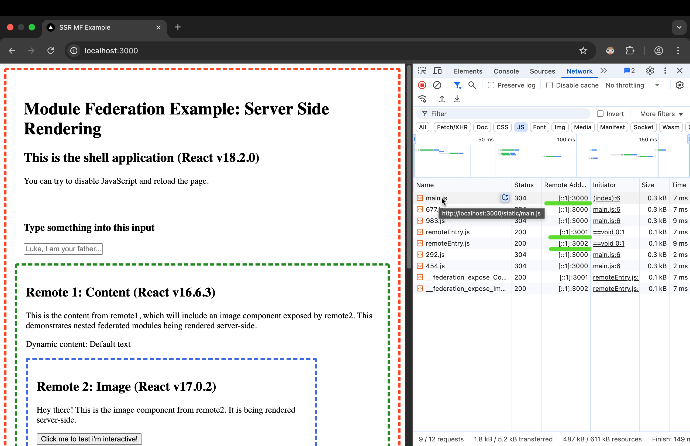

# Different React versions + SSR

This example demonstrates a shell application loading remote components and rendering them server side using React 16, 17 and 18.

> **Note:** This project was originally a subfolder in the [module-federation-examples](https://github.com/module-federation/module-federation-examples/tree/master) repository and has been extracted to be a standalone repository.

- `shell` is the host application which includes the SSR server (React v18.2.0).
- `remote1` standalone application which exposes `Content` component and consumes `Image` from `remote2` (React v16.6.3).
- `remote2` standalone application which exposes `Image` component (React v17.0.2).

## Running Demo

Run `pnpm install` to install the dependencies.

Run `pnpm start` this will build and start all applications.

Bellow you can see the port mapping:

- [localhost:3000](http://localhost:3000/) (SHELL)
- [localhost:3001](http://localhost:3001/) (STANDALONE REMOTE1)
- [localhost:3002](http://localhost:3002/) (STANDALONE REMOTE2)
